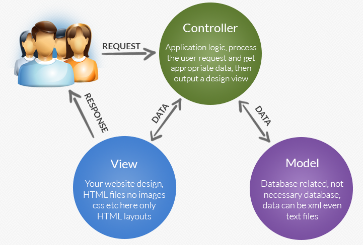

### ExpressJS là gì?

- ExpressJS là một framework Node.js tối giản và linh hoạt, cung cấp nhiều tính năng mạnh mẽ trong việc xây dựng ứng dụng web server.

- ExpressJS là một trong những framework phổ biến nhất trong thế giới Node.js. Có khá nhiều các thư viện khác sử dụng ExpressJS bên trong, ví dụ như NestJS (cũng là một web framework khác với nhiều tính năng hơn).

- ExpressJS cho phép chúng ta viết các API một cách nhanh chóng. Nó cũng có cơ chế “middleware” để giúp chúng ta trả về kết quả chính xác cho client. ExpressJS rất tối giản. Cho phép lập trình viên có thể viết ứng dụng theo bất cứ kiến trúc nào họ muốn.

### Mô hình MVC


- Mô hình mcv là quy ước viết chương trình. Theo đó, các việc xử lý request, hiển thị dữ liệu , xử lý dữ liệu phải tách bạch ra theo quy định.
- M: Model, xử lý các method liên quan đến dữ liệu
- V: View , giao diện người dùng. Nodejs có 1 vài template engines (Template engine helps us to create an HTML template with minimal code) như pug, Mustache, EJS
- 1 vài template engines [# link](https://colorlib.com/wp/top-templating-engines-for-javascript/)
- C: controller xử lý logic app

### Luồng chạy Luồng chạy cơ bản của MVC vào Express

- Router nhận diện và phân luồng các request theo method. Trong router có middleware để tiền xử lý hoặc hậu sử lý các request
- Router chia các request đến từng Controller
- Controler xử lý logic gọi đến model để lấy dữ liệu ra để sử lý theo yêu cầu của client

### Làm quen với npm

1. Cài đặt package

```
npm install <packageName>
```

or

```
npm i <packageName>
```

2. Cài đặt package theo version

```
npm i <packageName>@<version>
```

3. Cài đặt package Dev Dependency

```
npm i <packageName> --save-dev
```

4. Gỡ cài đặt

```
npm uninstall <pagekageName> -> npm un <pagekageName>
```

5. Cài đặt package global

```
npm install/uninstall packageName -g
```

6. Update package

```
npm update
```


### Build express first

```integrationperformancetest
npm init

npm install nodemon --save-dev

npm install express

npm install joi
```

### Routing với express

Ứng dụng web server cơ bản là cung cấp một loạt các đường dẫn ra bên ngoài. Từ đó, các clients có thể sử dụng những đường dẫn đó để truy cập hoặc xử lý những logic nhất định. Một vài ví dụ với các đường dẫn khác nhau của một ứng dụng web:

```
https://vnexpress.net/
https://vnexpress.net/the-gioi
https://vnexpress.net/kinh-doanh
https://vnexpress.net/kinh-doanh/quoc-te
https://vnexpress.net/the-thao
```

Việc tạo ra các đường dẫn vào cho phép các clients gọi tới được gọi là routing.

ExpressJS cho phép định nghĩa ra các đường dẫn một cách khá đơn giản:

```
app.get('/home', (req, res) => {
		console.log('Home')
		res.send('Hello, world!')
})
```

- `app`: ứng dụng express đã được khởi tạo từ trước
- `.get()`: một function của ExpressJS. Function này được sử dụng để khai báo một đường dẫn bên trong ứng dụng ExpressJS. Function này nhận vào các tham số như sau:
    - `'/home'`: cấu hình tên đường dẫn. Điều này cho phép các clients được phép gọi vào đường dẫn `<example.com>/home`
    - `(req, res) ⇒ {}`: function xử lý tương ứng với đường dẫn (handler function). Function này sẽ được gọi khi có một request từ phía client gửi tới đường dẫn `<example.com>/home`. Function nhận vào hai tham số:
        - `req`: object gồm các thông tin được gửi lên từ phía client
        - `res`: object được sử dụng để gửi response về cho client
    - `res.send()`: function để gửi dữ liệu về cho phía client. Dữ liệu được trả về có thể có nhiều kiểu khác nhau. Chúng ta cũng có một function khác là `res.json()` để trả về dữ liệu cho phía client dưới dạng JSON. Chúng ta luôn cần trả về kết quả cho phía client để kết thúc một chu trình với HTTP Request/Response.

### Lấy dữ liệu từ phía server với API

```
const students = [
	{name: "Alice", age: 10},
	{name: "Bob", age: 11},
	{name: "Charlie", age: 11},
]

app.get('/students', () => {
	res.json(students)
});


// kết quả
[
	{"name": "Alice", "age": 10},
	{"name": "Bob", "age": 11},
	{"name": "Charlie", "age": 11},
]
```

### Thêm dữ liệu vào trong danh sách học sinh với một đường dẫn khác

Tiến hành tạo một đường dẫn mới là /students/add, thực hiện viện thêm mới một phần tử vào bên trong mảng:

```
app.get("/students/add", () => {
	students.push({name: "Daniel", age: 12})
	res.json(students)
})

// kết quả
[
	{"name": "Alice", "age": 10},
	{"name": "Bob", "age": 11},
	{"name": "Charlie", "age": 11},
    {"name": "Daniel", "age": 12}
]
```

### Routing dễ quản lý hơn với express.Router()

Tiến hành thêm vào một đường dẫn là /teachers để quản lý thông tin giáo viên

```
app.get('/students', (req, res) => {...})
app.get('/students/add', (req, res) => {...})
app.get('/teachers', (req, res) => {...})
app.get('/teachers/add', (req, res) => {...})
```

Khi có nhiều đường dẫn -> tách file chức năng `student.js` và `teacher.js`

```
# student.js
const express = require('express')
const studentRouter = express.Router()

studentRouter.get('/', (req, res) => {...})
studentRouter.get('/add', (req, res) => {...})

module.exports = studentRouter
```

và

```
# teacher.js
const express = require('express')
const teacherRouter = express.Router()

teacherRouter.get('/', (req, res) => {...})
teacherRouter.get('/add', (req, res) => {...})

module.exports = teacherRouter
```

Cuối cùng tại app.js

```
const teacherRouter = require('./teacher.js')
const studentRouter = require('./student.js')

app.use('/teacher', teacherRouter)
app.use('/student', studentRouter)

app.listen(...)
```

### Dữ liệu bên trong Request

`req.params`
Trong thực tế, chúng ta có lẽ đã nhìn thấy những đường dẫn như sau:

```
http://www.example.com/student/1
http://www.example.com/teacher/1
http://www.example.com/student/1/class
http://www.example.com/student/1/class/2/timetable
```

Các con số `1` và `2` trong những endpoint ở trên là một phần của đường dẫn. Tuy nhiên, chúng thường mang ý nghĩa là định danh cho các đối tượng mà chúng ta cần xử lý: lấy học sinh có ID là 1, lấy danh sách lớp học của học sinh có ID là 1, … Những thành phần này được gọi là tham số trên đường dẫn (URL params).

Để ExpressJS có thể hiểu đó là các tham số trên đường dẫn, chúng ta cần cấu hình như sau:

```jsx
studentRouter.get('/:id', (req, res) => {
	console.log(req.params) // {id: '1'}
})

studentRouter.get('/:id/class', (req, res) => {
	console.log(req.params) // {id: '1'}
})

studentRouter.get('/:id/class/:classId', (req, res) => {
	console.log(req.params) // {id: '1', classId: '2'}
})
```

ExpressJS lúc này sẽ có thể hiểu rằng ở các vị trí `:id` và `:classId` sẽ là các giá trị được cấu hình động thông qua đường dẫn. Và nó sẽ gán tương ứng giá trị nằm ở vị trí đó với các key bên trong object `req.params`. Lập trình viên có thể thực hiện các logic khác nhau dựa vào giá trị đến từ object này.

<b><i>Chú ý: Chúng ta có thể có số lượng params tuỳ thích trên một đường dẫn. Tuy nhiên, chúng ta cần đảm bảo rằng các tên params không trùng nhau. Nếu có 2 tên params bị trùng nhau, Express sẽ tiến hành lấy giá trị được khai báo ở sau cùng. Ví dụ với đường dẫn là studentRouter.get(':id/class/:id'), khi ta gọi đến địa chỉ /student/1/class/2, thì req.params sẽ là {id: 2}</i></b>

### `req.query`

Trong thực tế cũng sẽ có những đường dẫn có dạng như sau:

```
http://www.example.com/search?q=test&limit=10
```

Phần `?q=test&limit=10` cũng là một thành phần của đường dẫn. Thành phần này có tên là URL query string, có những đặc điểm sau:

- Dữ liệu dạng key-value, phân tách bởi dấu `=`
- Các cặp key-value được phân tách nhau bởi dấu `&`

Với ExpressJS, chúng ta không cần thay đổi cấu hình đường dẫn. Và sử dụng `req.query` để truy cập vào các giá trị nằm trong query string như sau:

### `req.params` vs `req.query`

Cả params và query string đều là cách thức để clients có thể đính kèm các thông tin trên đường dẫn API. Chúng có đặc điểm chung là:

- Kiểu dữ liệu nhận được bên trong `req.params` và `req.query` đểu là string. Vì vậy, cần cẩn thận xử lý các logic bên trong handler.

Những điểm khác biệt của chúng là

- Params là một thành phần bắt buộc của URL. Trong khi đó, Query hoàn toàn optional và có thể không có bất cứ giá trị nào được gửi lên.
- Params thường được sử dụng để chỉ đích danh một đối tượng đã có. Trong khi query được sử dụng như tham số truyền thêm, phục vụ mục đích định nghĩa các điều kiện tìm kiếm tương ứng.

### `req.body`

Bên trong một HTTP Request sẽ gồm 2 thành phần:

- Header: Tiêu đề của request. Đây là nơi lưu các cấu hình của một Request. Nó có ý nghĩa giống như phong bì của một bức thư.
- Body: Nội dung bên trong. Đây là nơi chúng ta có thể truyền dữ liệu từ client. Nó có ý nghĩa giống như nội dung bên trong của bức thư.

Để có thể đọc được body của request, chúng ta sử dụng `req.body`. Các dạng dữ liệu bên trong `req.body` rất đa dạng: dữ liệu form, dữ liệu JSON, hoặc thậm chí là các file.  Trong khoá học này, chủ yếu chúng ta sử dụng dữ liệu dạng JSON để xử lý. Với ExpressJS, ta cần cấu hình thêm một chút cho ứng dụng, để nó có thể xử lý được dạng JSON bên trong `req.body`:

```jsx
// GET /student - {name: "Alice"}

...
app.use(express.json())
app.use('/student', studenRouter);
...
...
studentRouter.get("/", (req, res) => {
	console.log(req.body); // {name: "Alice"}
})
```

Request body là nơi chúng ta sử dụng để truyền các dữ liệu từ phía client lên web server. Ví dụ, với việc thêm mới học sinh, chúng ta có thể nhận dữ liệu về học sinh đó từ phía client, thay vì phải hard coded như trên.

### HTTP Request Methods & Rest API

HTTP định nghĩa một tập hợp các “methods” để ký hiệu cho mục đích của API đối với một tài nguyên cụ thể. Học sinh hoặc giáo viên trong các ví dụ trên là các tài nguyên của ứng dụng. Có khá nhiều các HTTP methods khác nhau, tuy nhiên, những methods hay được sử dụng là:

- `GET` sử dụng để truy vấn tài nguyên: lấy danh sách học viên, lấy học viên với ID tương ứng, …
- `POST` sử dụng để thêm mới tài nguyên: thêm mới một học sinh vào danh sách.
- `PUT` sử dụng để cập nhật một tài nguyên: cập nhật tên học sinh, cập nhật danh sách lớp của học sinh.
- `DELETE` sử dụng để xoá một tài nguyên: xoá học sinh, xoá giáo viên, …

Các methods này khác nhau về ngữ nghĩa. Và nó cũng khác nhau về một số đặc tính sau:

- **Safe - Tính an toàn**: Việc `GET` dữ liệu từ trong hệ thống được coi là an toàn, vì chúng không làm thay đổi dữ liệu. Trong khi đó, `POST`, `PUT` và `DELETE` được gọi là không an toàn, vì chúng chỉnh sửa dữ liệu của hệ thống.
- **Idempotent** (không thực sự có từ tiếng Việt tương ứng): Một phương thức HTTP được xem là idempotent nếu sau nhiều lần gọi, nó vẫn trả về kết quả như nhau. Ví dụ với `POST`, mỗi lần được gọi, hệ thống sẽ thêm một resource tương ứng. Như vậy, `POST` không được coi là “idempotent”. Với `PUT`, khi được gọi N lần, resource sẽ được cập nhật N lần. Có thể mỗi lần cập nhật dữ liệu sẽ khác nhau. Tuy nhiên kết quả luôn là một resource được cập nhật. Vì vậy, `PUT` được coi là "idempotent”
- **Cachable - Ghi nhớ:** Việc ghi nhớ dữ liệu trả về của lần gọi HTTP request trước khi có nhiều request cùng một thời điểm có thể giúp cho dữ liệu được trả về nhanh hơn. Tuy nhiên, do các methods `POST`, `PUT` và `DELETE` làm cho dữ liệu trong ứng dụng bị thay đổi, khiến cho dữ liệu được ghi nhớ không còn đúng nữa, nên các methods này không thể được “cache”. Với `GET`, do nó không làm thay đổi dữ liệu của ứng dụng, nên nó hoàn toàn có thể được “cached” để tăng tốc xử lý.

Với các khái niệm liên quan tới HTTP methods như trên, người ta đã tạo ra một quy ước để viết các đường dẫn một cách khoa học, dễ đọc, dễ bảo trì sau này. Đó là Rest API. Bản chất của Rest API chỉ đơn thuần là những quy ước để tạo ra các đường dẫn xoay quanh một resource nhất định. Rest API quy ước như sau:

```
GET    /student           => Get all students
GET    /student/:id       => Get a student with ID
POST   /student           => Create new student
PUT    /student/:id       => Update a student with ID
DELETE /student/:id       => Delete or hide a student with ID
GET    /student/:id/class => Get sub resources of a student with ID
```

### Structure project using npm package `express-generator`

- Refs: https://expressjs.com/en/starter/generator.html

### Build Restful API using express demo