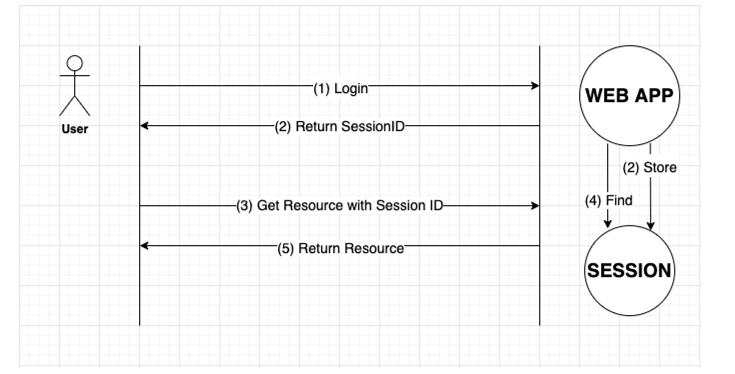
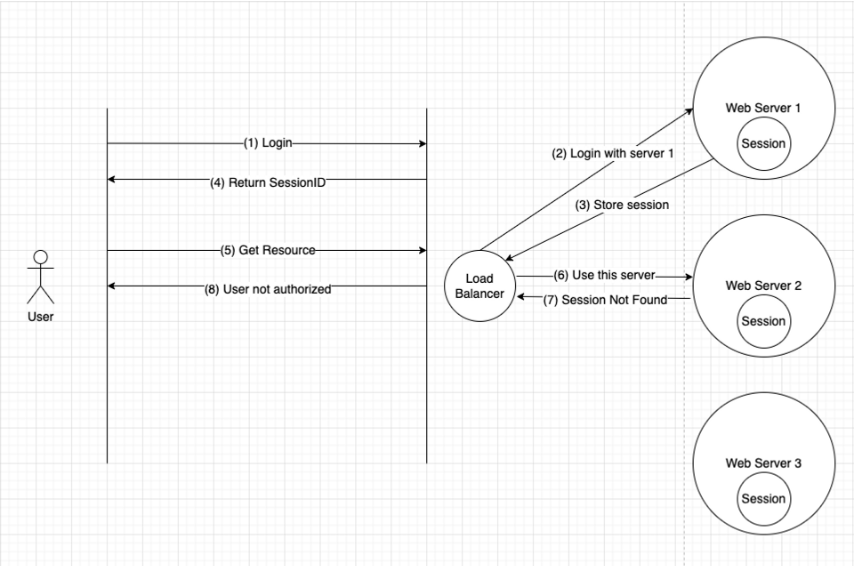
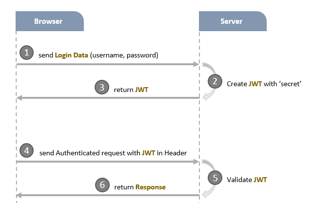
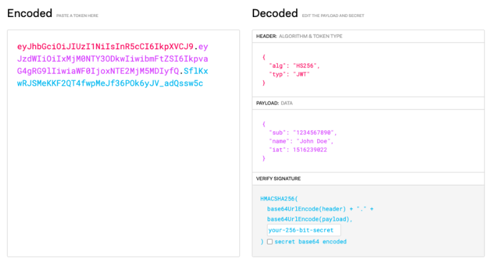

## Authentication và Authorization

### 1. Authentication (bạn là ai ?)
- Authentication là quá trình hệ thống kiểm tra, xác định danh tính của người dùng hoặc một hệ thống khác đang truy cập vào hệ thống hiện tại.
- Authentication xác thực chủ yếu dựa trên hai thông tin: tên người dùng và mật khẩu.

### 2. Authorization (bạn được làm gì ?)
- Authorization thường được thực hiện sau khi quá trình authentication kết thúc.
- Xác định bước tiếp theo xác định bạn được phép làm gì trong hệ thống.

### Session Authentication
Session là một trong những cách phổ biến để xác thực người dùng, đã tồn tại tư lâu. Hình vẽ sau mô tả lại cơ chế hoạt động của session.



Các bước thực hiện như sau:

1. Người dùng tiến hành đăng nhập vào hệ thống theo nhiều cách thức khác nhau.
2. Ứng dụng thực kiểm tra đăng nhập. Nếu thông tin đăng nhập là hợp lệ, ứng dụng lưu lại thông tin người dùng. Đó là session. Sau đó, ứng dụng trả lại cho người dùng session ID, là định danh của session vừa được tạo.
3. Khi người dùng truy cập vào các tài nguyên khác nhau của ứng dụng, người dùng cần gửi thêm thông tin session ID. Thông thường, thông tin này được gửi cùng trong cookie.
4. Ứng dụng sử dụng session ID để lấy thông tin liên quan tới người dùng đang đăng nhập. Nếu người dùng hợp lệ, tiến hành trả dữ liệu lại cho người dùng.

Cơ chế này hoạt động hoàn toàn bình thường và hiệu quả trong các trường hợp thông thường. Tuy nhiên, các ứng dụng web càng ngày càng phức tạp hơn. Ứng dụng có thể chạy trên nhiều web server. Việc đảm bảo chia sẻ dữ liệu session gặp khó khăn, do các thông tin liên quan tới session được lưu trữ riêng biệt trên từng web server. Điều này khiến cho cơ chế session không thực sự còn phù hợp.



JWT được sử dụng như một giải pháp thay thế cho session. Nhằm khắc phục nhược điểm của nó.

### Token Based Authentication

- Sơ đồ hoạt động của JWT



- Giải thích:
  + Khi chúng ta đăng nhập một tài khoản và gửi các thông tin như email/password lên server thì nó sẽ ký một token
  + Và gửi token đó về phía client để lưu trữ.
  + Cứ như vậy mỗi lần client truy cập trang thì sẽ gửi request lên thì phải kèm theo token
  + Server sẽ check mã này và gửi lại response thành công hay thất bại tương ứng ngược về client.

- Các thành phần của JWT
    + Header
    + Payload
    + Signature
    
- Cấu trúc kết hợp: `header.payload.signature`
- Ứng dụng Client thường đính kèm mã JWT vào header với tiền tố Bearer

```angular2html
Authorization: Bearer [header].[payload].[signature]
```

hoặc chỉ cần thêm một trường x-access-token trong header

```angular2html
x-access-token: [header].[payload].[signature]
```

### Dữ liệu bên trong một JWT:

Theo chuẩn RFC7519, các thông tin tiêu chuẩn được lưu trữ bên trong JWT là:

- `iss` (Issuer): người tạo ra token
- `sub` (Subject): chủ đề của token
- `aud` (Audience): người nhận mà token dự định sẽ được gửi tới
- `exp` (Expiration time): thời gian token hết hạn
- `nbf` (Not before time): thời gian token bắt đầu có hiệu lực
- `iat` (Issued at): thời gian token được tạo ra.
- `jid` (JWT ID): định danh của JWT

Ngoài các trường dữ liệu tiêu chuẩn như trên, một token còn có thể lưu trữ các trường dữ liệu do chúng ta thêm vào. Các trường dữ liệu được thêm vào có thể được sử dụng nhằm phục vụ mục đích xử lý sau này.

### Khoá bí mật và chữ ký

JWT hoạt động dựa trên các thuật toán liên quan tới mã hoá. Các thông tin thêm vào bên trong token kèm với một “khoá bí mật” là một chuỗi string bất kỳ sẽ được mã hoá tạo thành một chuỗi ký tự duy nhất. Để có thể giải mã được chuỗi ký tự đó, bắt buộc chúng ta cần phải sử dụng “khoá bí mật” đã tạo ra chuỗi ký tự đó. Vì vậy, nếu như khoá bí mật giống nhau, các server hoàn toàn có thể giải mã được token do các server tạo ra. Đây là lý do cho việc sử dụng JWT để thực hiện việc xác thực trên nhiều server khác nhau.



Khoá bí mật (Private Key) là thành phần rất quan trọng trong hệ thống xác thực với JWT. Việc để lộ Private key sẽ giúp cho kẻ xấu dễ dàng giải mã được các token. Từ đó dẫn tới thông tin người dùng có thể bị lộ. Vì vậy, KHÔNG bao giờ đẩy khoá bí mật lên các dịch vụ như GitHub hay tương tự.

## JWT với nodejs và mongodb

- Bước 1: Thiết lập web server
- Bước 2: Thiết lập database
- Bước 3: Định nghĩa Schema model
- Bước 4: Xử lý yêu cầu đăng ký
  + 1. Tạo user
  + 2. Validate user
  + 3. Check email có tồn tại hay không
  + 4. Mã hóa password
- Bước 5: Xử lý yêu cầu đăng nhập
  + 1. Validate user
  + 2. Check email và password
  
- Bước 6: Xử lý xác thực bằng JWT
  + 1. Tạo token
  + 2. Verify token

## Hướng dẫn code theo từng step

- Tóm tắt các công việc cần làm:
1. Đăng ký (validate, mã hóa password)
2. Đăng nhập (lấy về token)
3. Sử dụng token để truy cập các private routes khác.